# 🛠️ Corrections des Exercices Docker

Ce document recense les problèmes rencontrés dans les différents exercices d'application du dossier `Exercices` et détaille les corrections apportées pour les rendre fonctionnels.

---

## 🌐 Exercice 1 - WebStatic (`ex1-webstatic`)

### ❌ Problème initial
Lors du lancement de la stack avec la commande `docker compose up`, le conteneur démarrait sans remonter d'erreur dans le terminal. Cependant, le site restait totalement injoignable via le navigateur à l'adresse `http://localhost:8080`.

### 🔍 Explication technique
L'image utilisée pour ce service est `nginx:alpine`. Par défaut, un serveur Nginx écoute les requêtes HTTP sur le port **80** à l'intérieur du conteneur. 
Le fichier `docker-compose.yml` d'origine tentait de relier le port 8080 de la machine hôte au port `8081` du conteneur, port sur lequel Nginx n'écoutait pas, d'où l'impossibilité d'afficher la page.

### ✅ Correction apportée
Dans le fichier `docker-compose.yml`, j'ai corrigé la section `ports` pour faire pointer le port local `8080` vers le port `80` du conteneur.

**Avant correction :**
```yaml
    ports:
      - "8080:8081"
```

**Après correction :**
```yaml
    ports:
      - "8080:80"
```

*Le site est désormais correctement accessible sur http://localhost:8080.*

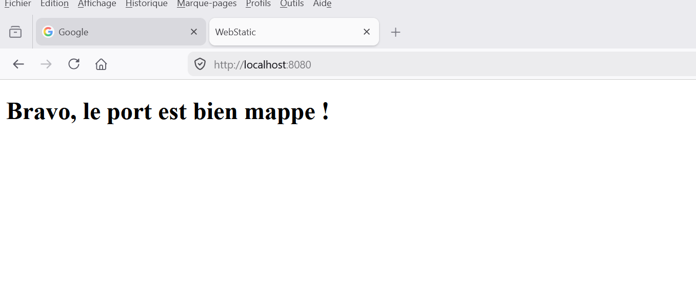

---

## 📝 Exercice 2 - BlogApp (`ex2-blogapp`)

### ❌ Problème initial
Lors du lancement de la stack avec `docker compose up`, Docker Compose refusait de démarrer et renvoyait une erreur indiquant qu'il ne trouvait pas le service défini dans les dépendances de l'application.
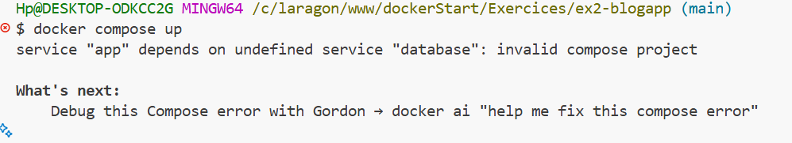


### 🔍 Explication technique
Dans la section `depends_on` du service `app`, il était indiqué que celui-ci dépendait d'un service nommé `database`. Cependant, plus bas dans le fichier `docker-compose.yml`, le service MySQL s'appelait en réalité `db`. En raison de cette incohérence de nommage, Docker Compose ne pouvait pas faire la liaison.

### ✅ Correction apportée
J'ai corrigé le nom du service attendu dans la section `depends_on` du service `app` pour qu'il corresponde exactement au nom déclaré pour le service de base de données (`db`).

**Avant correction :**
```yaml
    depends_on:
      - database
```

**Après correction :**
```yaml
    depends_on:
      - db
```

*La stack démarre désormais correctement sans erreur de dépendance !*
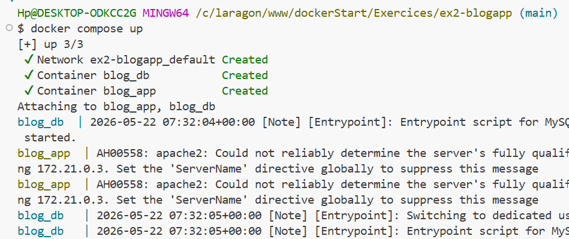
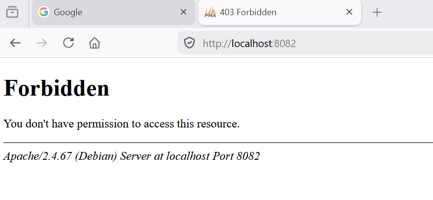

---

## 🚀 Exercice 3 - ApiNode (`ex3-apinode`)

### ❌ Problème initial
Lors du lancement de la commande `docker compose up`, Docker Compose renvoyait une erreur de parsing (analyse) du fichier YAML et refusait de démarrer le projet.

### 🔍 Explication technique
Le format YAML est strictement basé sur l'indentation (les espaces en début de ligne). Dans le fichier `docker-compose.yml`, la directive `ports` comportait des espaces en trop et était mal alignée par rapport aux autres propriétés du service `api` (comme `image` ou `working_dir`). À cause de ce décalage, Docker Compose ne parvenait pas à lire correctement la structure hiérarchique du fichier.

### ✅ Correction apportée
J'ai supprimé les espaces excédentaires pour réaligner la section `ports` au même niveau que les autres configurations du service (soit un retrait de 4 espaces par rapport au bord gauche).

**Avant correction :**
```yaml
    working_dir: /app
      ports:
        - "3000:3000"
```
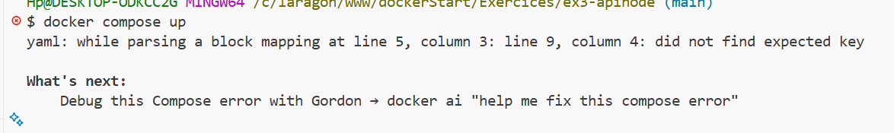


**Après correction :**
```yaml
    working_dir: /app
    ports:
      - "3000:3000"
```

*L'API Node.js démarre maintenant correctement, sans erreur de syntaxe !*
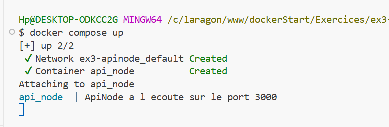
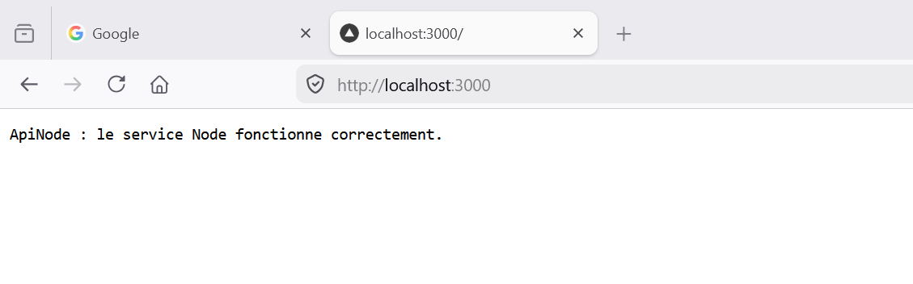

---

## 🐬 Exercice 4 - DataMySQL (`ex4-datamysql`)

### ❌ Problème initial
Lors du lancement de la commande `docker compose up`, Docker Compose refusait de démarrer et renvoyait une erreur de syntaxe empêchant la lecture complète du fichier YAML.

### 🔍 Explication technique
En YAML, il ne doit y avoir aucun espace entre le nom d'une clé et les deux-points (`:`) qui la suivent. Dans le fichier `docker-compose.yml`, la directive `environment` était sans les deux-points (`environment:`).

### ✅ Correction apportée
J'ai ajouté les deux-points pour la clé `environment:`.

**Avant correction :**
```yaml
    environment
      MYSQL_ROOT_PASSWORD: secret
      MYSQL_DATABASE: catalogue
```
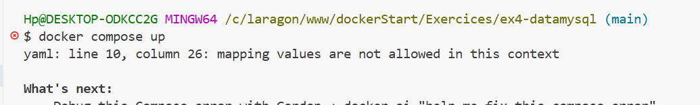

**Après correction :**
```yaml
    environment:
      MYSQL_ROOT_PASSWORD: secret
      MYSQL_DATABASE: catalogue
```

*La base de données MySQL démarre désormais correctement, sans erreur de syntaxe !*
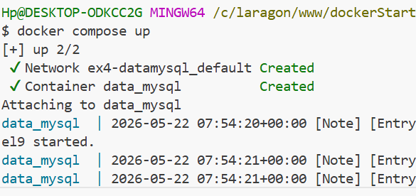


---

## 🔗 Exercice 5 - MultiStack (`ex5-multistack`)

### ❌ Problème initial
Lors du lancement de la commande `docker compose up`, Docker Compose renvoyait une erreur indiquant que le réseau `backnet` était introuvable.

### 🔍 Explication technique
Les services `frontend` et `backend` sont configurés pour utiliser un réseau personnalisé nommé `backnet`. Cependant, dans un fichier `docker-compose.yml`, tout réseau personnalisé utilisé dans les conteneurs doit obligatoirement être déclaré dans un bloc `networks:` principal (situé à la racine du fichier, au même niveau d'indentation que `services:`). Sans cette déclaration globale, Docker Compose refuse de démarrer car il ne sait pas qu'il doit créer le réseau.

### ✅ Correction apportée
J'ai ajouté le bloc principal `networks:` à la fin du fichier pour y déclarer explicitement le réseau `backnet`.

**Avant correction (fin du fichier) :**
```yaml
    networks:
      - backnet
```
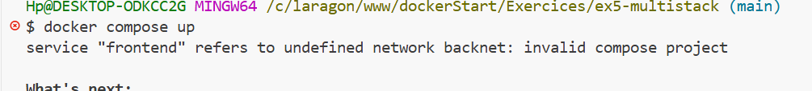

**Après correction (fin du fichier) :**
```yaml
    networks:
      - backnet

networks:
  backnet:
```

*La stack démarre désormais correctement, et les deux conteneurs peuvent communiquer via leur réseau commun !*
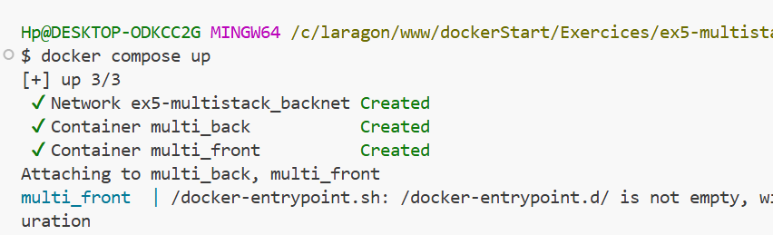
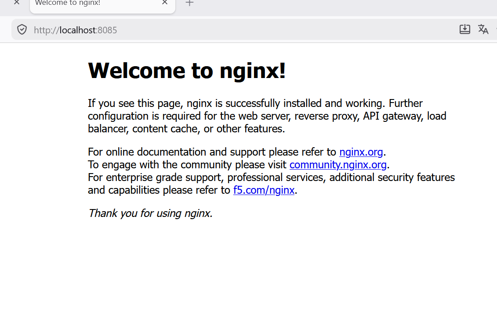

---

## 🗄️ Exercice 6 - CacheRedis (`ex6-cacheredis`)

### ❌ Problème initial
Lors du lancement de la commande `docker compose up`, Docker Compose renvoyait une erreur indiquant que le volume utilisé par le service n'était pas déclaré.
!avant correction

### 🔍 Explication technique
Le bloc global des volumes à la fin du fichier déclarait un volume nommé `redis_data`. Cependant, le service `cache` tentait d'utiliser un volume mal orthographié nommé `redisdata` (sans le tiret du bas). Puisque les deux noms n'étaient pas strictement identiques, Docker Compose ne parvenait pas à faire la liaison.

### ✅ Correction apportée
J'ai corrigé le nom du volume dans la configuration du service `cache` pour qu'il corresponde exactement à celui déclaré globalement (`redis_data`).

**Avant correction (dans le service `cache`) :**
```yaml
    volumes:
      - redisdata:/data
```
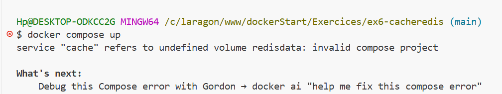

**Après correction (fin du fichier) :**
```yaml
volumes:
  redis_data:
```

*Le conteneur Redis démarre désormais correctement, et ses données sont bien persistées dans le volume !*
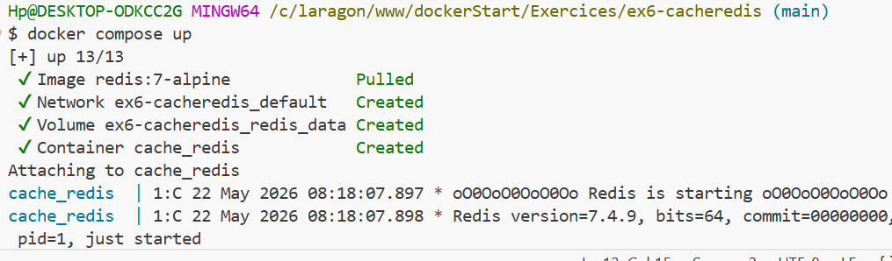


---

## 🌿 Exercice 7 - EnvService (`ex7-envservice`)

### ❌ Problème initial
Lors du lancement de la commande `docker compose up`, Docker Compose refusait de démarrer et renvoyait une erreur de format sur la définition des variables d'environnement.

### 🔍 Explication technique
Dans un fichier `docker-compose.yml`, l'instruction `environment` accepte deux formats : 
1. Un dictionnaire (mapping) : `CLE: valeur` (sans tiret)
2. Une liste (array) : `- CLE=valeur` (avec tiret et signe égal)

L'erreur consistait à mélanger ces deux syntaxes en mettant un tiret `-` devant des paires `clé: valeur`. Cela crée en YAML une "liste de dictionnaires", un format que Docker Compose ne supporte pas pour le bloc `environment`.

### ✅ Correction apportée
J'ai supprimé les tirets `-` pour conserver uniquement la syntaxe en dictionnaire (mapping).

**Avant correction :**
```yaml
    environment:
      - APP_MODE: production
      - APP_PORT: 4000
```
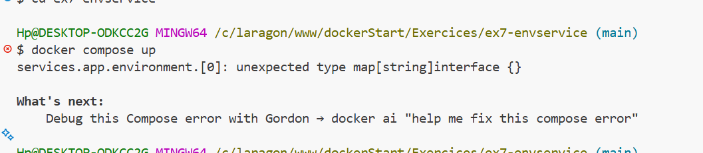


**Après correction :**
```yaml
    environment:
      APP_MODE: production
      APP_PORT: 4000
```

*Le conteneur démarre désormais correctement en chargeant bien ses variables d'environnement !*
!apres correction
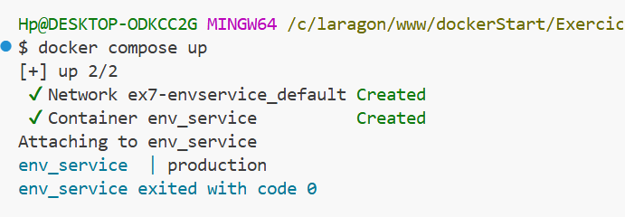

---


## 🏗️ Exercice 8 - FullStack (`ex8-fullstack`)

### ❌ Problème initial
Lors du lancement de la stack, deux problèmes survenaient : la page restait injoignable sur `http://localhost:8088` et le conteneur de l'API refusait de démarrer en indiquant qu'un réseau était introuvable.

### 🔍 Explication technique
1. **Erreur de port (Web) :** L'image `nginx:alpine` écoute par défaut sur le port **80** à l'intérieur du conteneur. Le fichier tentait de relier le port local 8088 au port `8080` du conteneur. Nginx n'écoutant pas sur ce port, la page était inaccessible.
2. **Erreur de réseau (API) :** Le service `api` tentait de rejoindre un réseau nommé `apinet` (faute de frappe). Or, le réseau déclaré globalement à la fin du fichier et utilisé par le service web s'appelait `appnet`.

### ✅ Correction apportée
J'ai rétabli le bon port de destination (`80`) pour le service Nginx et j'ai corrigé le nom du réseau dans le service `api` pour utiliser `appnet`.

**Avant correction :**
```yaml
  web:
    # ...
    ports:
      - "8088:8080"
  # ...
  api:
    # ...
    networks:
      - apinet
```
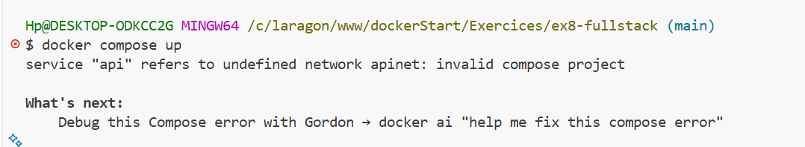


**Après correction :**
```yaml
  web:
    # ...
    ports:
      - "8088:80"
  # ...
  api:
    # ...
    networks:
      - appnet
```

*La stack complète démarre désormais sans erreur et les deux conteneurs sont correctement reliés !*
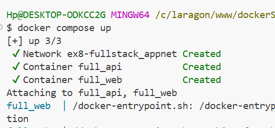

---