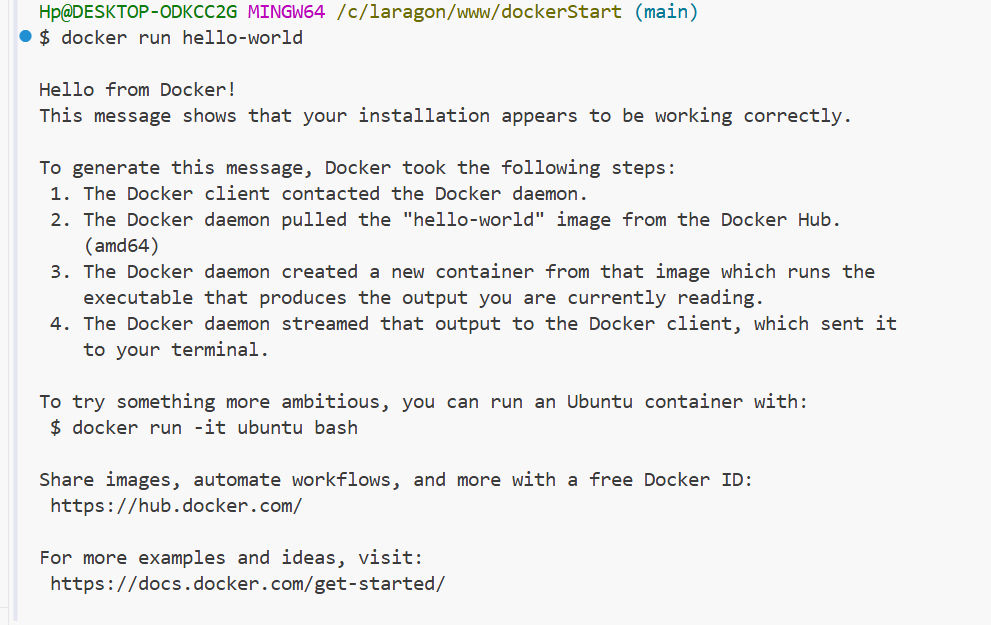
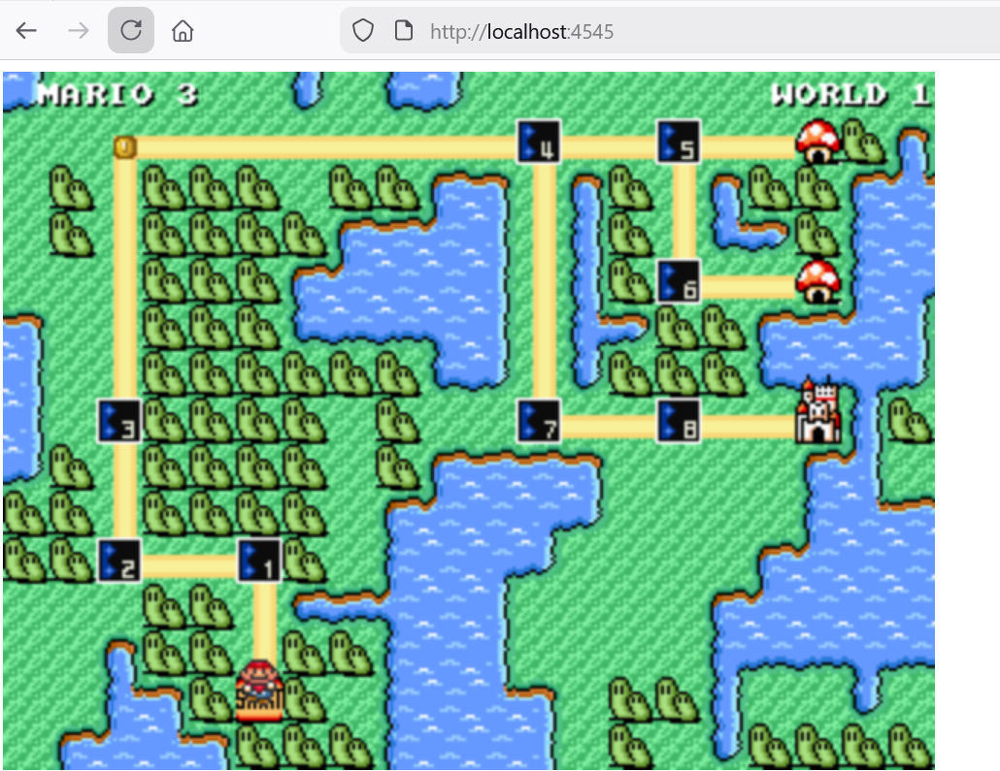
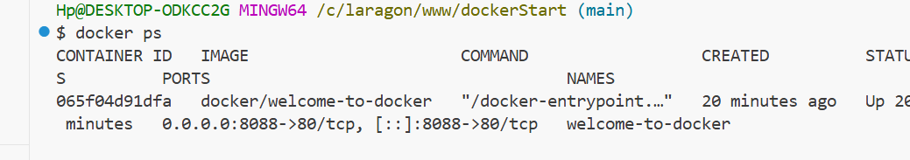
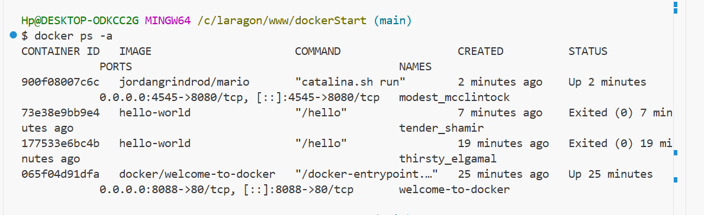
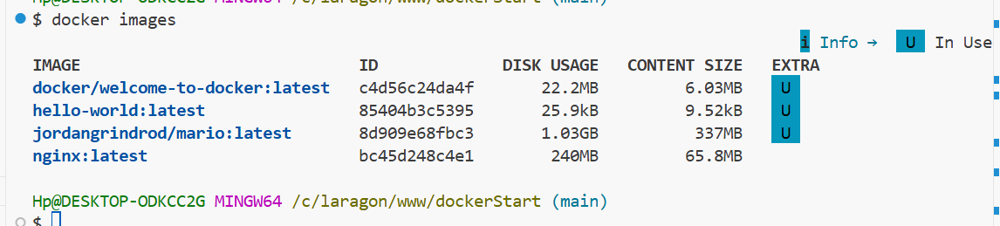
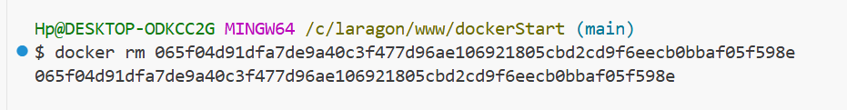
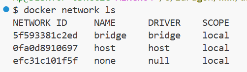
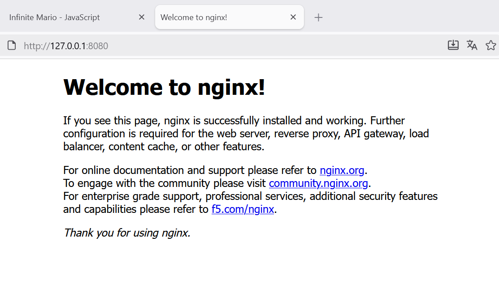

# 🐳 Initiation à Docker : Guide Pratique

Ce document retrace les étapes de mise en œuvre de Docker, de l'installation de base au déploiement d'applications conteneurisées plus complexes.

---

## 🚀 1. Validation de l'installation exécution de test standard.

**Commande :**
```bash
docker run hello-world
```


**Commande :**
```bash
docker run -d -p 8088:80 --name welcome-to-docker docker/welcome-to-docker
```


---

## 🎮 2. Déploiement d'une application (Super Mario)
Nous avons utilisé une image contenant un émulateur pour tester le déploiement d'une application plus volumineuse.

**Commande :**
```bash
docker run -idt -p 4545:8080 jordangrindrod/mario
```



## 📊 3. Gestion et suivi des conteneurs
Pour vérifier quels conteneurs tournent sur la machine et suivre leur état, on utilise les commandes de listing.

Lister les conteneurs actifs :
```bash
docker ps
```


Lister tous les conteneurs (actifs et arrêtés) :
```bash
docker ps -a
```


## 💾 4. Gestion des images locales
Pour voir la liste de tous les modèles d'applications (images) téléchargés sur la machine, on utilise la commande suivante :

Commande :
```bash
docker images
```


## 🗑️ 5. Suppression d'un conteneur
Une fois qu'un conteneur n'est plus utile (et qu'il est arrêté), il est préférable de le supprimer pour libérer des ressources.
Commande :
```bash
docker rm 065f04d91dfa7de9a40c3f477d96ae106921805cbd2cd9f6eecb0bbaf05f598e
```


On n'est pas obligé de mettre l'ID en entier les 12 premiers caractères suffisent pour que docker l'identifie : 
```bash
docker rm 065f04d91dfa
```


La commande docker network ls est essentielle pour comprendre comment vos conteneurs communiquent entre eux ou avec l'extérieur. Voici comment l'intégrer et l'expliquer dans ton README :

## 🌐 6. Gestion du réseau (Networking)
Docker crée des réseaux isolés pour permettre aux conteneurs de communiquer. Pour voir les réseaux disponibles sur votre machine, on utilise la commande de listing.
```bash
docker network ls
```


## 🛰️ 7. Déploiement d'un serveur Web Nginx
Nous avons déployé un serveur Nginx, qui est un serveur HTTP haute performance, pour tester l'exposition de services web.
```bash
docker run -d -p 8080:80 nginx
```



## 📑 Récapitulatif des commandes 

| Commande | Action |
| :--- | :--- |
| `docker run` | Créer et démarrer un conteneur |
| `docker ps` | Voir les conteneurs qui tournent |
| `docker images` | Voir les images téléchargées |
| `docker network ls` | Voir les réseaux disponibles |
| `docker stop` | Arrêter un conteneur |
| `docker rm` | Supprimer un conteneur arrêté |
| `docker rmi` | Supprimer une image |


## 🧼 Nettoyage des ressources
Les commandes de maintenance :
* **Arrêter un conteneur :** `docker stop [nom]`
* **Supprimer les conteneurs arrêtés :** `docker container prune`
* **Supprimer une image :** `docker rmi [image_id]`