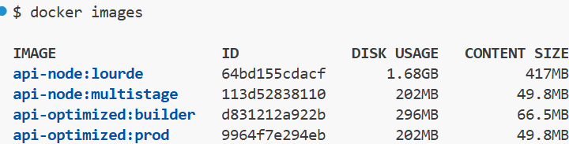
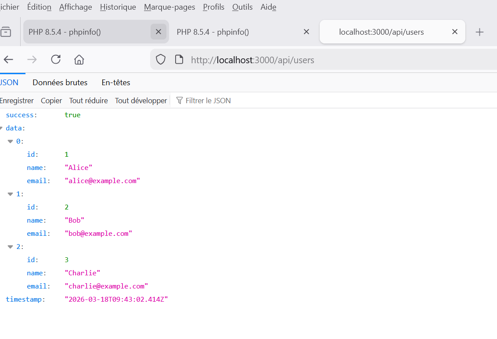
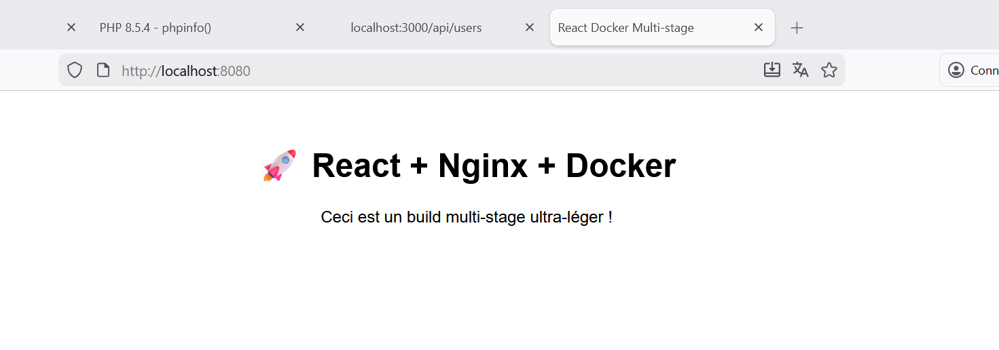

# 🐳 Projet Docker Multi-stage Build : Fullstack API & React

Ce projet démontre la puissance du **Multi-stage Build** avec Docker. Cette technique permet de réduire la taille des images de production de plus de 90% en séparant l'environnement de build de l'environnement d'exécution.

---

## 🏗️ 1. Étude de cas : Backend API TypeScript

Pour l'API, j'ai comparé une construction classique (contenant tout l'environnement de développement) et une construction optimisée.

### Comparaison des approches
* **Build classique** (`Dockerfile.lourd`) : Inclut Node.js complet, TypeScript, les sources et toutes les dépendances.
* **Build Multi-stage** (`Dockerfile`) : Ne garde que le JavaScript compilé sur une base Alpine Linux ultra-légère.

#### 📊 Verdict des tailles (Rendu 1)
| Image | Tag | Taille Virtuelle | Gain |
| :--- | :--- | :--- | :--- |
| `api-node` | `lourde` | **1.68 GB** | - |
| `api-node` | `multistage` | **202 MB** | **~88% de réduction** |

**Capture de la comparaison :**


---

## 🛠️ Commandes de construction (API)

 # Construction de l'étape intermédiaire (Builder)
   ```bash
   docker build --target builder -t api-optimized:builder ./api-ts
```

## 📊 Comparaison des Tailles (Rendu 1)

L'image de production est significativement plus petite que l'image de build grâce au retrait des fichiers sources, de TypeScript et des devDependencies.

---

## 🚀 Tests de fonctionnement (Rendu 2)

### ✅ API Backend (Port 3000)

Lancement du conteneur de production :
```bash
docker run -d -p 3000:3000 --name api-container api-optimized:prod
```

Résultat dans le navigateur :


---

## 🌐 Frontend : React + Nginx

Pour le frontend, nous passons d'un environnement Node.js lourd à un serveur Nginx minimaliste qui ne sert que les fichiers statiques (HTML/JS/CSS).

Commandes :
```bash
# Construction de l'image de production
docker build -t react-app:prod ./frontend-react

# Lancement du conteneur sur le port 8080
docker run -d -p 8080:80 --name react-container react-app:prod
```

### ✅ Test Frontend (Port 8080)

L'application est servie avec succès par Nginx.


---

## 📄 Focus sur le Dockerfile Multi-stage (API)
```dockerfile
# ÉTAPE 1 : BUILDER (Compilation)
FROM node:20-alpine AS builder
WORKDIR /app
COPY package*.json ./
COPY tsconfig.json ./
RUN npm install
COPY src ./src
RUN npm run build

# ÉTAPE 2 : PRODUCTION (Runtime)
FROM node:20-alpine AS prod
WORKDIR /app
ENV NODE_ENV=production

# On ne récupère que le nécessaire du builder
COPY --from=builder /app/package*.json ./
RUN npm install --only=production
COPY --from=builder /app/dist ./dist

EXPOSE 3000
CMD ["node", "dist/index.js"]
```

---

## 💡 Conclusion : Pourquoi le Multi-stage ?

- 🔒 **Sécurité** : Le code source et les outils de build ne sont pas exposés en production.
- 🪶 **Légèreté** : Les images sont plus rapides à transférer sur le réseau (CI/CD).
- ⚡ **Optimisation** : Réduction drastique de l'empreinte disque sur les serveurs de production.