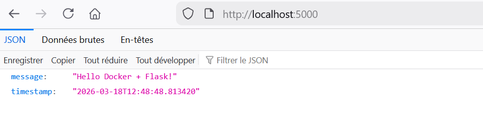
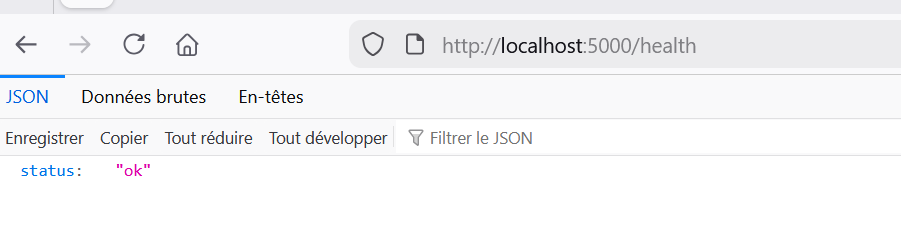
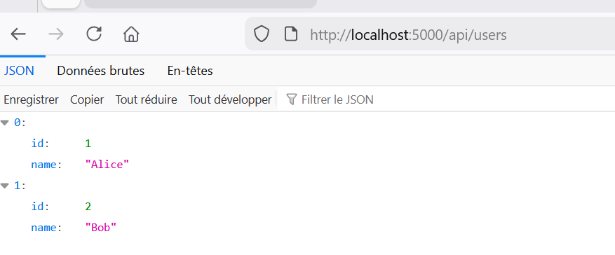

# 🐍 Job 06 - API Flask avec Docker

> Formation DWWM - La Plateforme_

Une API REST construite avec **Python Flask**, conteneurisée avec **Docker**, avec deux configurations : développement et production (Gunicorn).

---

## 📁 Structure du projet

```
flask-api/
├── app/
│   ├── __init__.py       # Factory de l'application Flask
│   └── routes.py         # Définition des routes
├── images/
│   ├── localhost5000.png
│   ├── health.png
│   └── apiusers.png
├── requirements.txt      # Dépendances Python
├── run.py                # Point d'entrée
├── Dockerfile            # Image de développement
└── Dockerfile.prod       # Image de production (Gunicorn)
```

---

## ⚙️ Prérequis

- [Docker](https://www.docker.com/) installé sur votre machine

---

## 📦 Dépendances (`requirements.txt`)

```
flask==3.0.0
flask-cors==4.0.0
python-dotenv==1.0.0
gunicorn==21.2.0
```

---

## 🐳 Dockerfiles

### Dockerfile (Développement)

```dockerfile
# Image Python légère — slim évite les outils inutiles sans les problèmes d'alpine
FROM python:3.11-slim

# Métadonnées
LABEL maintainer="ton.email@example.com"

# Pas de fichiers .pyc générés
ENV PYTHONDONTWRITEBYTECODE=1
# Logs Python affichés en temps réel
ENV PYTHONUNBUFFERED=1

WORKDIR /app

# Copie requirements en premier → mise en cache Docker si le code change
COPY requirements.txt .
RUN pip install --no-cache-dir -r requirements.txt

COPY . .

EXPOSE 5000

CMD ["python", "run.py"]
```

### Dockerfile.prod (Production)

```dockerfile
FROM python:3.11-slim

ENV PYTHONDONTWRITEBYTECODE=1
ENV PYTHONUNBUFFERED=1

WORKDIR /app

COPY requirements.txt .
RUN pip install --no-cache-dir -r requirements.txt

COPY . .

# Sécurité : exécution avec un utilisateur non-root
RUN useradd -m appuser && chown -R appuser /app
USER appuser

EXPOSE 5000

# Gunicorn : serveur WSGI robuste pour la production avec 4 workers parallèles
CMD ["gunicorn", "--bind", "0.0.0.0:5000", "--workers", "4", "run:app"]
```

---

## 🚀 Build et lancement

### Version développement

```bash
# Construction de l'image
docker build -t flask-api:dev .

# Lancement du conteneur
docker run -d -p 5000:5000 --name flask-dev flask-api:dev
```

### Version production

```bash
# Construction de l'image de production
docker build -f Dockerfile.prod -t flask-api:prod .

# Lancement du conteneur
docker run -d -p 5000:5000 --name flask-prod flask-api:prod
```

---

## 🧪 Tests des routes

### Routes disponibles

| Méthode | Route | Description |
|---|---|---|
| GET | `/` | Message de bienvenue + timestamp |
| GET | `/health` | Vérification de l'état de l'API |
| GET | `/api/users` | Liste des utilisateurs |
| POST | `/api/users` | Créer un nouvel utilisateur |

### Commandes de test

```bash
# Route principale
curl http://localhost:5000

# Vérification santé
curl http://localhost:5000/health

# Liste des utilisateurs
curl http://localhost:5000/api/users

# Créer un utilisateur (POST)
curl -X POST http://localhost:5000/api/users \
  -H "Content-Type: application/json" \
  -d '{"name": "Charlie"}'
```

---

## ✅ Captures d'écran

### 🌐 Route `/` — Message de bienvenue



### 💚 Route `/health` — Vérification de l'état



### 👥 Route `/api/users` — Liste des utilisateurs



---

## 📊 Comparaison des tailles — `python:3.11` vs `python:3.11-slim`

| Image | Taille |
|---|---|
| `python:3.11` (complète) | 1.61 GB |
| `python:3.11-slim` (utilisée ici) | 188 MB |
| `flask-api:dev` (notre image) | 196 MB |
| `flask-api:prod` (notre image) | 196 MB |

**`python:3.11-slim` est ~8x plus légère que `python:3.11`.**

Notre image Flask n'ajoute que ~8 Mo à la base slim (Flask + dépendances), ce qui démontre l'efficacité de partir d'une image légère.

> `python:3.11` embarque des compilateurs, headers C, docs et outils de développement inutiles en production. La version `slim` ne conserve que le strict minimum pour exécuter Python.

---

## 💡 Pourquoi deux Dockerfiles ?

| | `Dockerfile` (dev) | `Dockerfile.prod` (prod) |
|---|---|---|
| Serveur | Flask dev server | Gunicorn (4 workers) |
| Utilisateur | root | `appuser` (non-root) |
| Usage | Développement local | Déploiement en production |
| Sécurité | Basique | Renforcée |

### Avantages de la version production

- 🔒 **Sécurité** : utilisateur non-root, code source non exposé
- ⚡ **Performance** : Gunicorn gère plusieurs requêtes en parallèle
- 🪶 **Légèreté** : images rapides à transférer en CI/CD
