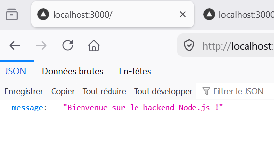
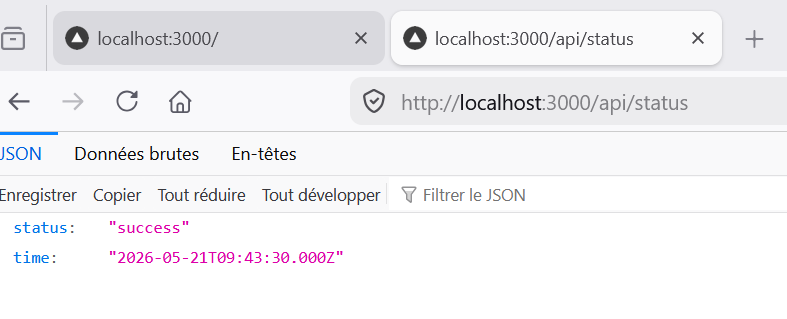
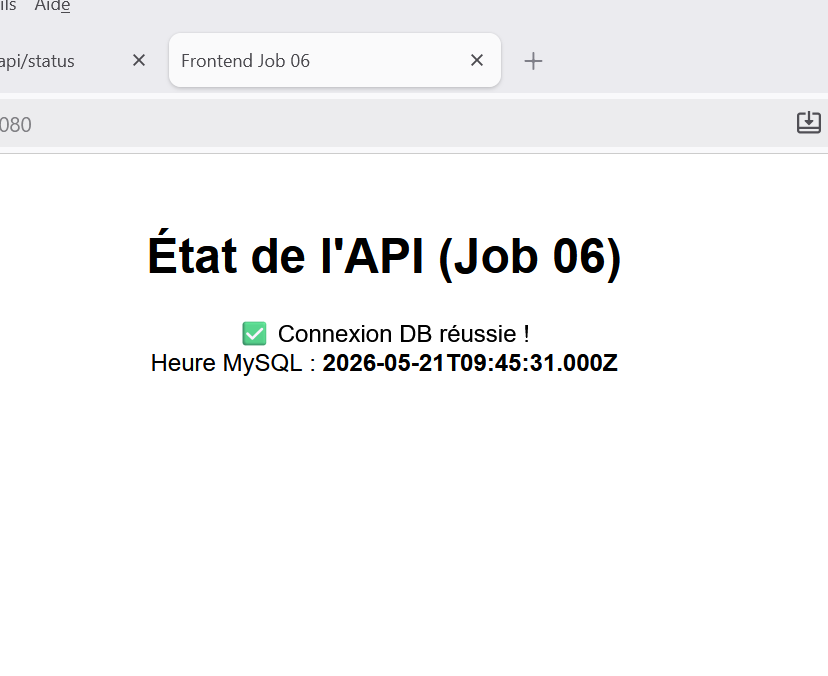
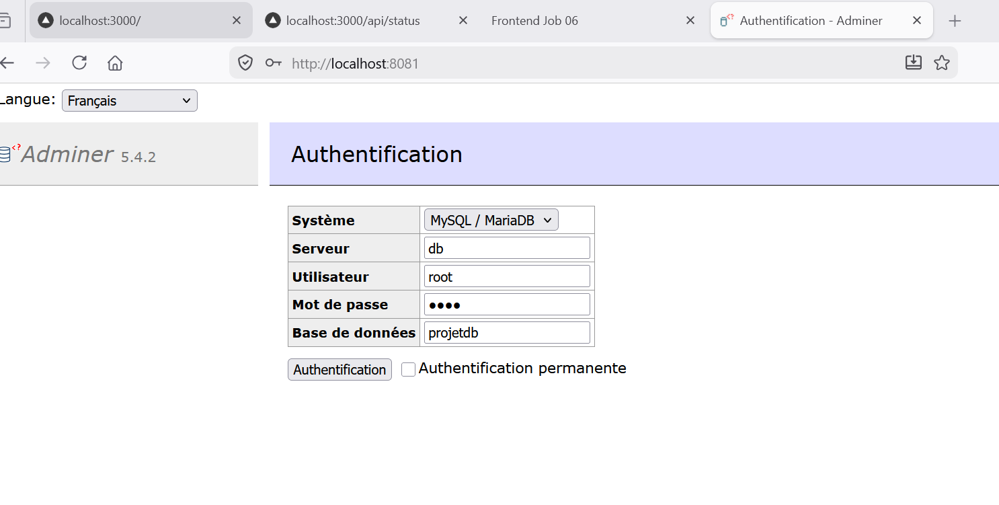
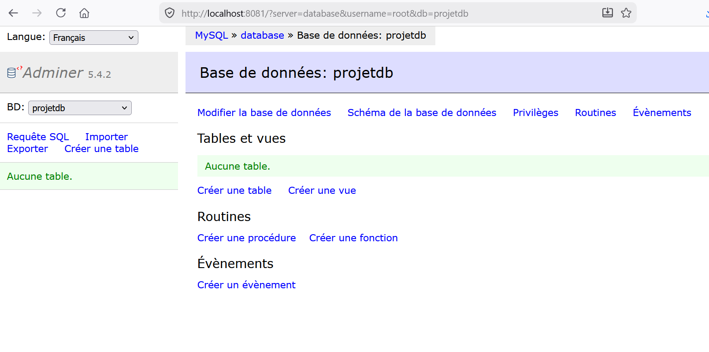
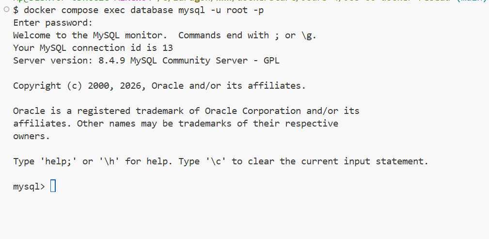
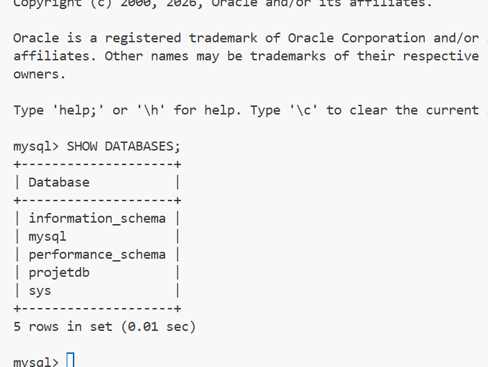
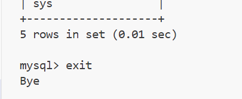

# 🐳 Job 06 : Déploiement Multi-Conteneurs (Réseau Docker)

Ce projet met en place une architecture multi-services complète où 4 conteneurs communiquent entre eux via le réseau interne de Docker.

---

## 🏗️ Architecture des Services

| Service | Image Docker | Port Hôte | Description |
| :--- | :--- | :--- | :--- |
| **database** | `mysql:8` | `3306` | Base de données MySQL. |
| **backend** | `node:20-alpine` (Build) | `3000` | API Node.js + Express. Connectée à `database`. |
| **nginx** | `nginx:alpine` | `8080` | Serveur web servant la page Frontend statique. |
| **adminer** | `adminer` | `8081` | Interface graphique de gestion de la BDD. |

---

## 🚀 Démarrer l'environnement

Pour construire les images (notamment le backend Node.js) et lancer les conteneurs en arrière-plan :

```bash
docker compose up -d --build
```

---

## 🌐 Accès et Démonstration

Une fois la stack démarrée, vérifiez le bon fonctionnement via les URL suivantes :

1. **Backend (Message de bienvenue)** : http://localhost:3000


2. **Backend (Statut API & Heure BDD)** : http://localhost:3000/api/status


3. **Frontend (Interface NGINX)** : http://localhost:8080


4. **Adminer (Gestion BDD)** : http://localhost:8081
   * **Serveur** : `database`
   * **Utilisateur** : `root`
   * **Mot de passe** : `root`
   * **Base de données** : `projetdb`

---


## 💻 Accès au Shell MySQL (Ligne de commande)

L'accès direct via `http://localhost:3306` retournera une erreur web car il s'agit du port du protocole MySQL, pas HTTP. 


Pour manipuler la base de données en ligne de commande depuis le terminal :

1. **Entrer dans le conteneur MySQL :**
   ```bash
   docker compose exec database mysql -u root -p
   ```
   *(Saisir le mot de passe : `root`)*

   

2. **Lister les bases de données :** `SHOW DATABASES;`


3. **Quitter le shell :** `exit`

