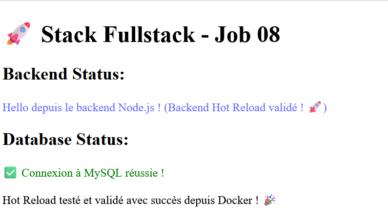
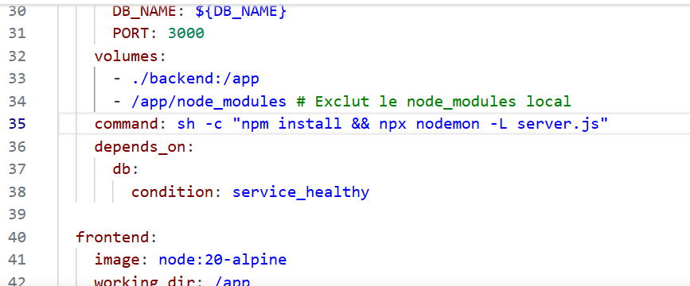
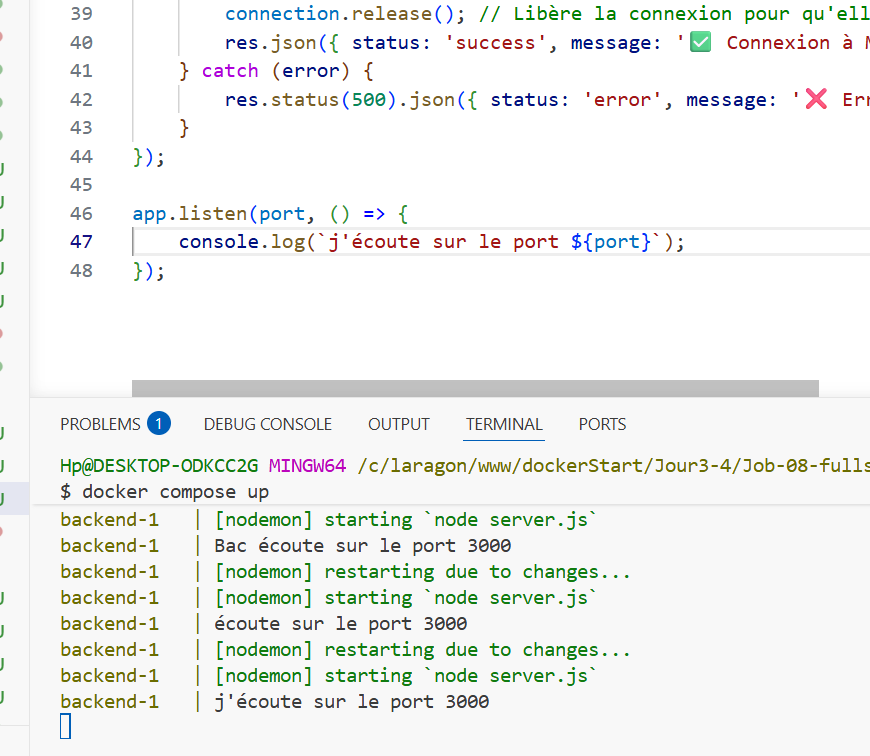

# 🚀 Stack Fullstack : React, Node.js & MySQL (Job 08)

Ce projet déploie une architecture microservices complète (Frontend, Backend, Base de données) entièrement conteneurisée et optimisée pour le développement local.

---

## 🏗️ Architecture des Services

| Service | Technologie | Port Hôte | Description |
| :--- | :--- | :--- | :--- |
| **Frontend** | Vite + React (Node 20 Alpine) | `5173` | Interface utilisateur avec **Hot Reload**. |
| **Backend** | Node.js + Express (Node 20 Alpine) | `3000` | API REST avec surveillance via `nodemon` (Polling). |
| **Base de données** | MySQL 8 | `3306` (interne) | Stockage persistant avec test de disponibilité (`healthcheck`). |

---

## 📸 Aperçu du Projet

*(Aperçu de l'interface affichant les statuts du Backend et de la Base de données)*

**Interface Frontend (React) :**



---

## ⚙️ Prérequis et Configuration

Avant de lancer le projet, il faut définir les variables d'environnement :
1. Copiez le fichier `.env.example` en le nommant `.env`.
2. Renseignez les mots de passe et configurations souhaités (ils seront automatiquement injectés dans les conteneurs).

---

## 🚀 Démarrer l'environnement

Pour construire et démarrer l'ensemble de la stack, exécutez la commande suivante à la racine du projet :

```bash
docker compose up
```
*(L'absence du mode détaché `-d` permet de voir les logs en direct, notamment l'installation des dépendances `npm install` et les statuts des serveurs).*

### 🌐 Accès aux applications
- **Frontend React** : http://localhost:5173
- **Backend API** : http://localhost:3000

---

## ✨ Fonctionnalités clés implémentées

### 🔄 Hot Reload Fonctionnel
- **Backend** : Grâce à `nodemon -L` (Legacy Watch / Polling), toute modification dans `server.js` redémarre instantanément l'API. Le mode Polling est indispensable sous Windows/Docker car les signaux de sauvegarde standards ne sont souvent pas détectés par le conteneur Linux.





- **Frontend** : L'utilisation de `CHOKIDAR_USEPOLLING=true` garantit le rafraîchissement automatique de Vite, même sous Windows/WSL.
**Preuve du Hot Reload en direct :**
!Preuve Hot Reload

### 🛡️ Gestion Intelligente du Démarrage (Healthcheck)
L'API backend a besoin de la base de données pour fonctionner. 
Plutôt que de démarrer en même temps et de planter car MySQL est encore en train de s'initialiser, le backend est configuré pour **attendre que MySQL soit prêt à recevoir des requêtes** :
```yaml
    depends_on:
      db:
        condition: service_healthy
```
*(Un ping est envoyé toutes les 10 secondes à MySQL jusqu'à son succès).*

### 📁 Gestion avancée des Volumes
Pour éviter les conflits entre les dépendances locales (Windows/Mac) et celles des conteneurs (Linux Alpine), des **volumes anonymes** isolent les dossiers `node_modules` :
```yaml
    volumes:
      - ./frontend:/app
      - /app/node_modules # Protège le dossier dans le conteneur
```
La persistance des données MySQL est quant à elle assurée par le volume `db_data`.