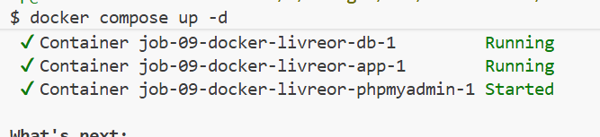
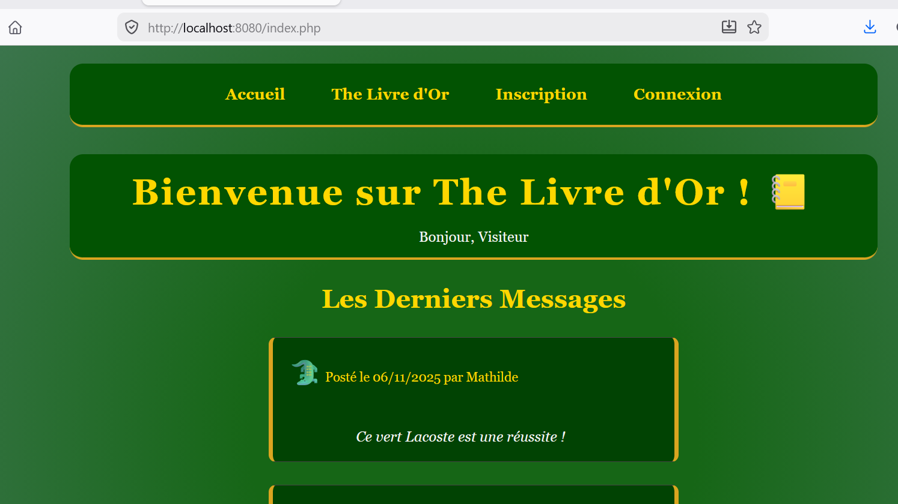

# 🐳 Projet Livre d'Or Dockerisé (Job 09)

Ce projet est la version conteneurisée (Docker) d'une application de Livre d'Or développée en PHP avec une base de données MySQL. Il inclut également phpMyAdmin pour faciliter l'administration de la base de données locale.

---

## 📋 Prérequis

- **Docker Desktop** (ou Docker Engine avec Docker Compose) installé et en cours d'exécution sur votre machine.

---

## 🚀 Démarrer l'environnement

Pour lancer l'ensemble des services en arrière-plan, placez-vous à la racine du projet et exécutez la commande suivante :

```bash
docker compose up -d
```
 
---

## 🌐 Accès aux applications

Une fois les conteneurs démarrés, vous pouvez accéder aux services directement via votre navigateur web :

- **Application Web (Livre d'or)** : [http://localhost:8080](http://localhost:8080)


- **Interface phpMyAdmin** : [http://localhost:8081](http://localhost:8081)
!phpMyAdmin](images/phpmyadmin.png)

**Identifiants de connexion (phpMyAdmin) :**
- **Serveur** : `db`
- **Utilisateur** : `root` (ou `dev_user`)
- **Mot de passe** : `rootpassword` (ou `dev_password`)

---

## ⏹️ Arrêter les services

Pour arrêter proprement les conteneurs (les détruire) sans perdre vos données :

```bash
docker compose down
```

---

## ♻️ Réinitialiser la base de données

Si vous souhaitez effacer toutes les données enregistrées et repartir à zéro (cela rechargera votre fichier dump `db/init.sql` initial au prochain démarrage), vous devez détruire les conteneurs **et le volume de données associé** :

```bash
docker compose down -v
```
