# Tic Tac Toe Docker

Petit projet Docker pour containeriser un jeu de morpion avec persistance des résultats via un volume nommé.

## 1. Arborescence du projet

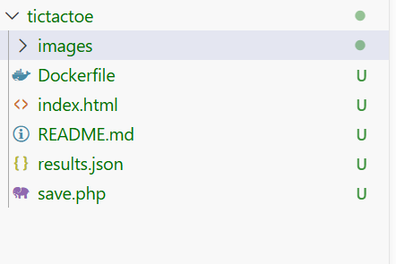

Le dossier contient le Dockerfile, les fichiers du jeu (index.html, save.php, results.json) et le dossier images.

## 2. Le Dockerfile

```dockerfile
# Image de base : PHP 8.2 + Apache préconfigurés
FROM php:8.2-apache
# Copier la page du jeu dans le dossier servi par Apache
COPY index.html /var/www/html/
# Copier save.php et results.json au même endroit
# (ce sera le futur point de montage du volume)
COPY save.php /var/www/html/
COPY results.json /var/www/html/
# Apache tourne sous l'utilisateur www-data, qui doit
# pouvoir écrire dans results.json
RUN chown www-data:www-data /var/www/html/results.json
# Le conteneur écoute sur le port 80 en interne
EXPOSE 80
```

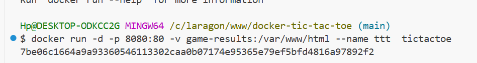

## 3. Construction de l'image

Commande utilisée :
```bash
docker build -t tictactoe .
```
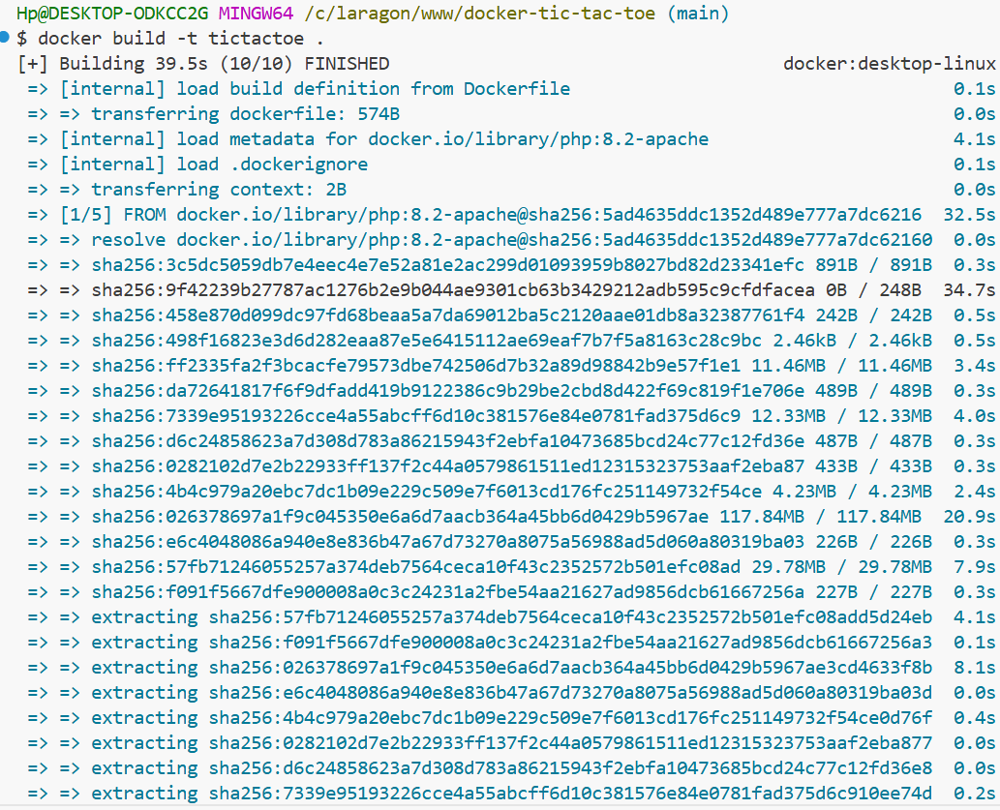
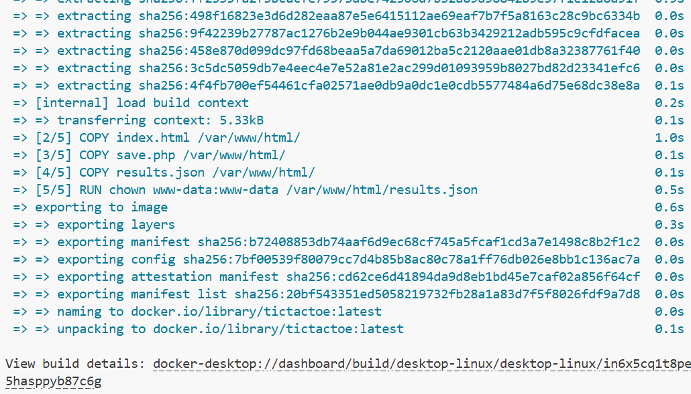

## 4. Création du volume

Commande utilisée pour créer le volume nommé qui stockera les résultats (le fichier `results.json`) de manière persistante :
```bash
docker volume create tictactoe-data
```
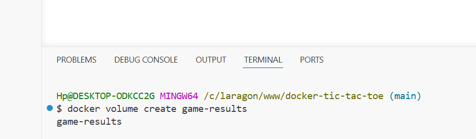
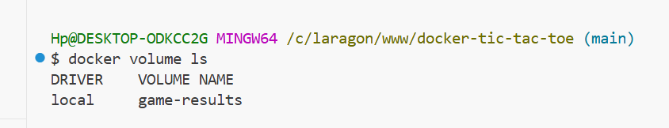


## 5. Lancement du conteneur

Commande utilisée pour démarrer le jeu en liant le volume créé précédemment :
```bash
docker run -d -p 8080:80 -v tictactoe-data:/var/www/html tictactoe
```
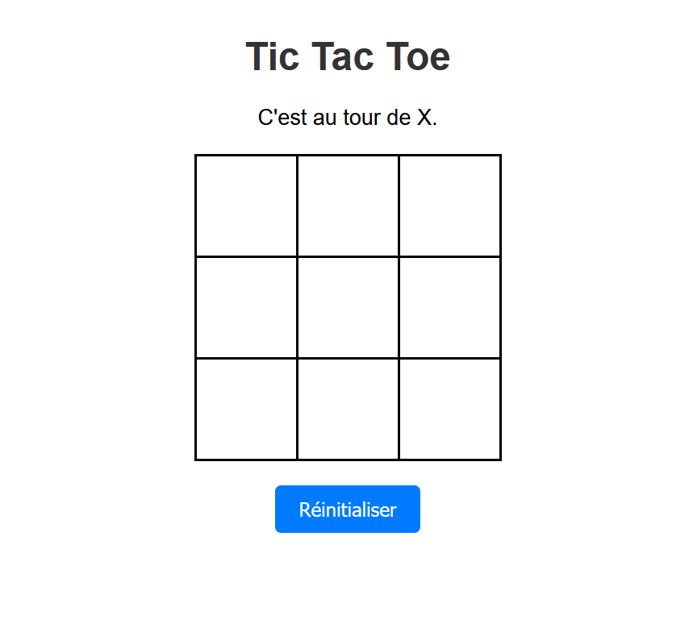

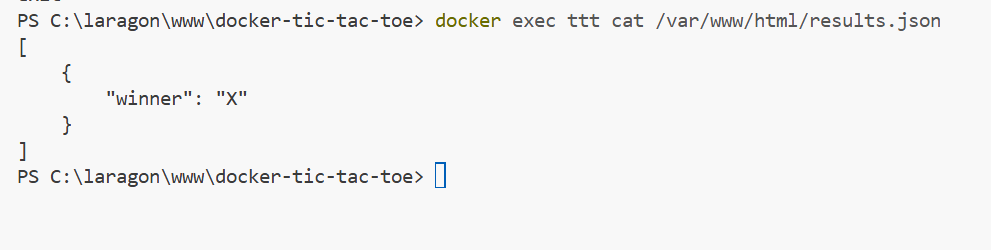

## 6. Tout faire dans Docker Desktop

Docker Desktop offre une interface graphique pour tout ce qu'on vient de voir :
1. Onglet "Containers" → on voit le conteneur ttt
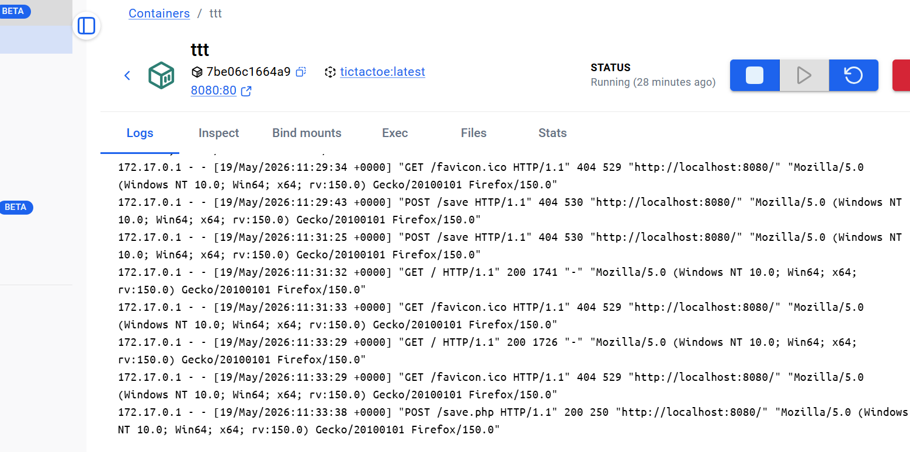
2. On clique dessus → onglet "Files" pour explorer son système de fichiers
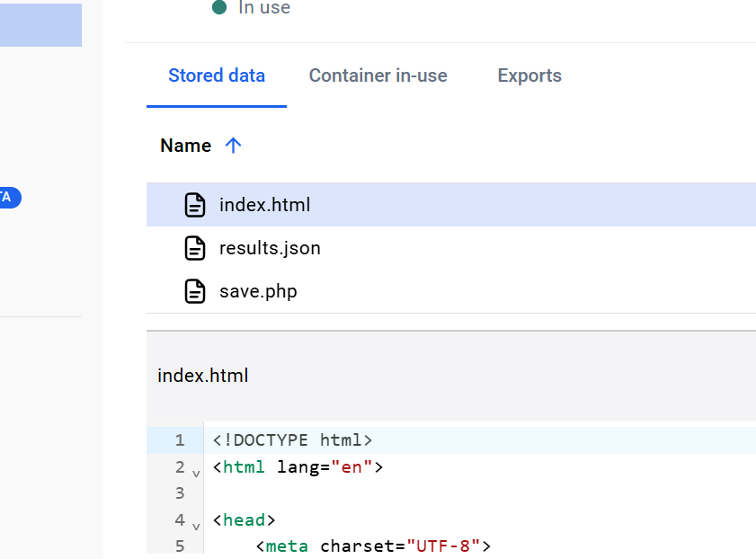
3. Onglet "Volumes" → on voit game-results
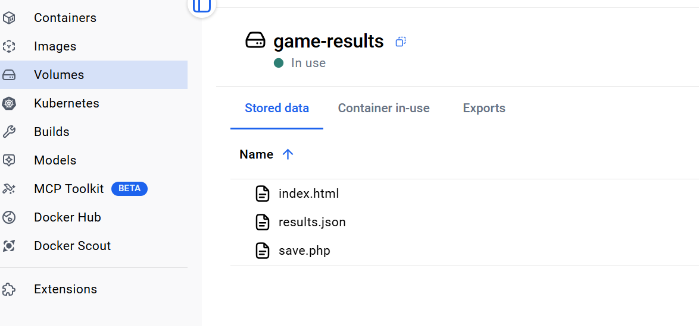
4. On clique dessus → onglet "Data" pour voir/éditer les fichiers du volume
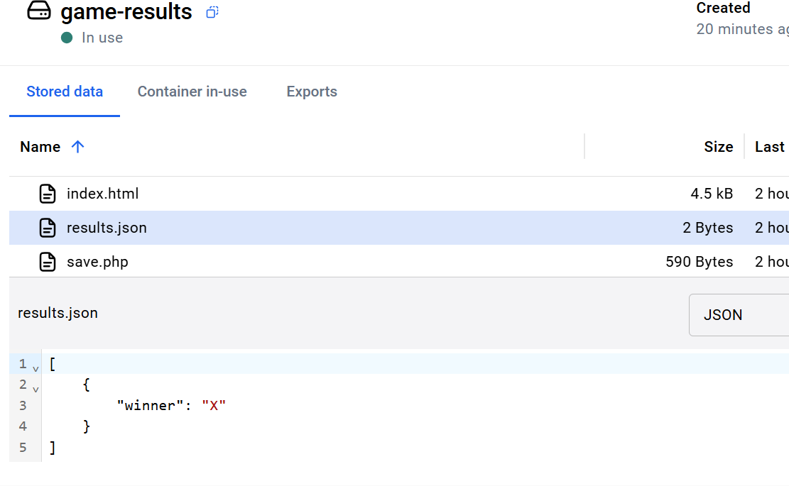
